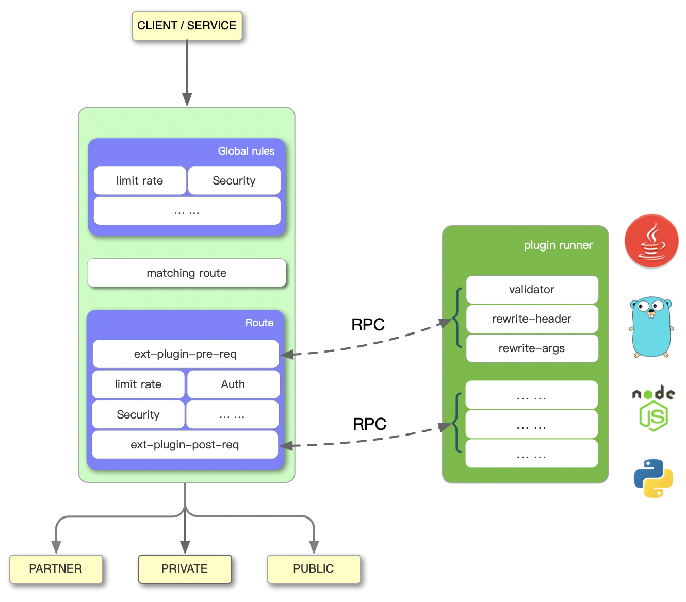

<!--
#
# Licensed to the Apache Software Foundation (ASF) under one or more
# contributor license agreements.  See the NOTICE file distributed with
# this work for additional information regarding copyright ownership.
# The ASF licenses this file to You under the Apache License, Version 2.0
# (the "License"); you may not use this file except in compliance with
# the License.  You may obtain a copy of the License at
#
#     http://www.apache.org/licenses/LICENSE-2.0
#
# Unless required by applicable law or agreed to in writing, software
# distributed under the License is distributed on an "AS IS" BASIS,
# WITHOUT WARRANTIES OR CONDITIONS OF ANY KIND, either express or implied.
# See the License for the specific language governing permissions and
# limitations under the License.
#
-->

# Python Plugin Runner for Apache APISIX

Runs [Apache APISIX](http://apisix.apache.org/) plugins written in Python. Implemented as a sidecar that accompanies
APISIX.

# Why apisix-python-plugin-runner

APISIX offers many full-featured plugins covering areas such as authentication, security, traffic control, serverless,
analytics & monitoring, transformations, logging.

It also provides highly extensible API, allowing common phases to be mounted, and users can use these api to develop
their own plugins.

APISIX supports writing plugins in multiple languages in
version [2.7.0](https://github.com/apache/apisix/blob/master/CHANGELOG.md#270), this project is APISIX Python side
implementation that supports writing plugins in Python.

# Use apisix-python-plugin-runner

For configuration and use, please refer to the [Getting Started](./docs/en/latest/getting-started.md) document.

# Get Involved in Development

Welcome to make contributions, but before you start, please check out
[Developer Guide](./docs/en/latest/developer-guide.md) to learn how to run and debug `apisix-python-plugin-runner`
in your own environment.

# Status

This project is currently in the experimental stage and it is not recommended to be used in a production environment.

# License

[Apache 2.0 LICENSE](./LICENSE)